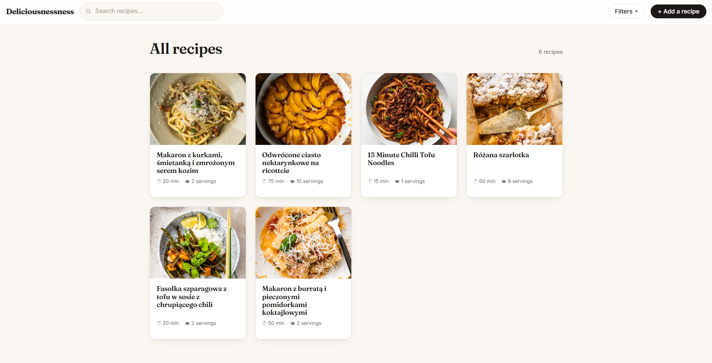

# Deliciousnessness

A personal recipe manager for a multilingual kitchen.

Recipes get collected in whatever language they were found in — Polish, German, Spanish,
English. Deliciousnessness lets you search for an ingredient in **any** of those languages
and find every recipe that uses it, regardless of the language the recipe itself is written in.
Search `cebula` and get back the German recipe that says `Zwiebel`.



## Features

- Recipe list with live search — results update as you type, no page reload
- Combinable filters: name, ingredients (all of them must be present), categories, seasons
- Ingredient autocomplete that matches in any language and resolves to one shared ingredient
- Recipes display ingredients in the wording they were written in, while staying linked to
  the shared ingredient underneath
- Ingredient sections within a recipe ("For the tofu", "For the noodles")
- Category management: rename, merge, delete
- 4,900+ ingredients with English, Polish, German and Spanish names seeded from Open Food Facts
- JSON API alongside the web pages

## How the cross-language search works

A recipe line does not store a word. It stores a link to an `Ingredient`, which is a
language-neutral concept. Each ingredient has any number of `IngredientName` rows — one per
word per language:

```
Ingredient #3202  (canonical: cherry tomato)
  ├─ cherry tomato        EN
  ├─ pomidor koktajlowy   PL
  ├─ pomidorki koktajlowe PL
  ├─ kirschtomaten        DE
  └─ tomate cherry        ES
```

Searching resolves the typed word to the ingredient, then finds recipes by that ingredient's id.
Which language the recipe was written in never enters into it.

To keep the recipe readable, each line also stores a `displayName` — the exact text the cook
typed. That is what gets printed; the link is what gets searched.

## Tech stack

| Layer | |
|---|---|
| Language | Java 17 |
| Framework | Spring Boot 4.1, Spring MVC, Spring Data JPA |
| Persistence | Hibernate 7, PostgreSQL |
| Templates | Thymeleaf |
| Frontend | Plain HTML, CSS and JavaScript — no framework |
| Build | Maven (wrapper included) |
| Tests | JUnit, Mockito, AssertJ, `RestTestClient` |

## Running it locally

### Prerequisites

- Java 17
- PostgreSQL 14 or newer, running locally on port 5432

### Database

Create two databases — one for the app, one for the integration tests:

```sql
CREATE DATABASE deliciousnessness;
CREATE DATABASE deliciousnessness_test;
```

The schema is created by Hibernate on first start. The ingredient data is seeded from
`src/main/resources/data.sql` automatically — it is idempotent, so it is safe to re-run on
every startup.

### Configuration

The database password is read from an environment variable and is never committed:

```bash
export DB_PASSWORD=your_postgres_password
```

Username defaults to `postgres`; change it in `src/main/resources/application.properties` if
yours differs.

### Start

```bash
./mvnw spring-boot:run
```

Then open <http://localhost:8080>.

### Tests

```bash
./mvnw test
```

Unit tests run with Mockito and need no database. The integration test boots the full
application against `deliciousnessness_test`, which is created fresh and dropped on every run.

## Routes

**Web**

| | |
|---|---|
| `GET /recipes` | list, with search and filter parameters |
| `GET /recipes/{id}` | recipe detail |
| `GET /recipes/new`, `GET /recipes/{id}/edit` | create / edit form |
| `POST /recipes/save`, `POST /recipes/{id}/delete` | form actions |
| `GET /categories` | manage categories |

**JSON API**

| | |
|---|---|
| `GET /api/recipes?q=&ingredients=&categories=&seasons=` | search |
| `GET /api/recipes/{id}` | one recipe |
| `POST /api/recipes`, `PUT /api/recipes/{id}`, `DELETE /api/recipes/{id}` | create / update / delete |
| `GET /api/ingredients/autocomplete?q=` | ingredient suggestions, any language |
| `GET /api/categories` | all categories |

## Project layout

```
src/main/java/io/everyonecodes/deliciousnessness/
├── controller/   web (Thymeleaf) and REST controllers
├── service/      business logic, transactions
├── repository/   Spring Data JPA repositories and JPQL queries
├── model/        JPA entities and enums
├── dto/          records crossing the controller boundary, plus the web form object
└── mapper/       entity → DTO
src/main/resources/
├── templates/    Thymeleaf pages and fragments
├── static/       CSS and JavaScript
└── data.sql      ingredient seed
```

## Data attribution

Ingredient names and translations are derived from the
[Open Food Facts ingredients taxonomy](https://github.com/openfoodfacts/openfoodfacts-server/blob/main/taxonomies/food/ingredients.txt),
made available under the [Open Database License (ODbL)](https://opendatacommons.org/licenses/odbl/1-0/).
Open Food Facts is a collaborative, free and open database of food products from around the world.

The seed in `data.sql` is a filtered and reshaped extract of that taxonomy, limited to four
languages, with additional ingredients and translations added by hand for the recipes in this
collection.

## Status

Built as a graded project for the everyone codes Java course.
Core functionality is complete; see the roadmap in the issues for what's planned next —
user accounts, favorites, and seasonal recommendations.

## Author

Johann Patiño
